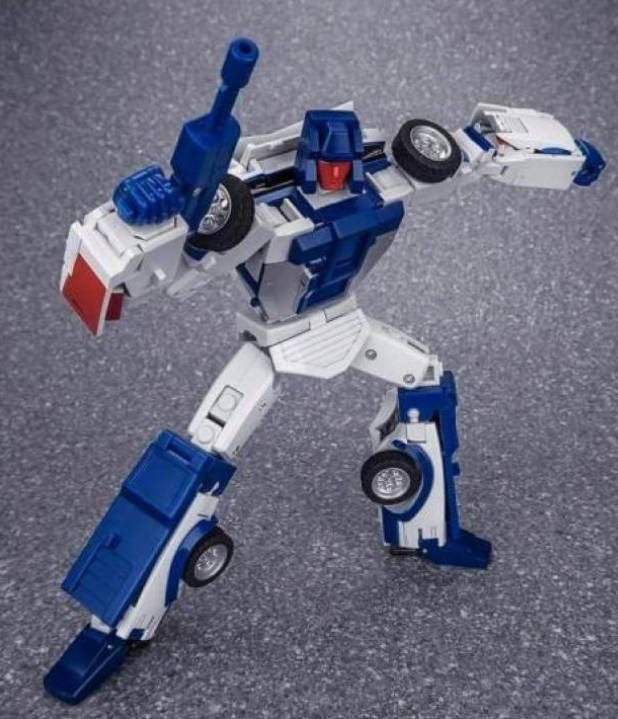

# Index <a name="Index"/>
- [Links](#Links)
- [D Series](#D-Series)
- [D Series - Atilla Combiner (Menasor)](#D-Series---Atilla-Combiner-(Menasor))

# Links 

<a href="#Index" style="text-align: right">Back to Index</a>

- Facebook: [DX9toys](https://www.facebook.com/dx9toys)
- Stores:
    - [Show.Z Store DX9](https://showzstore.com/c/dx9_0382)
    - [TFSource DX9](https://tfsource.com/dx9/)
    - [The Chosen Prime DX9 Toys](https://www.thechosenprime.com/DX9-Toys_bymfg_15-4-2.html)
    - [TF-Direct DX9 Toys](https://www.tf-direct.com/c/dx9-toys_0366)

# D Series

<a href="#Index" style="text-align: right">Back to Index</a>

## D01 Salmoore

## D02S Splinter

## D03 Invisible

## D03i Transparent Phantom Invisible

## D03C Cocomone

## D04 OP Armor Set

## D05 Chigurh

## D06 Carry

## D06T Terror

## D07 Tyrant

## D08 Gewalt

## D09 Supreme Leader

## D10 Hanzo

## D10G Hanzo - Retro Color Version

## D11 Richthofen

## D12 Gabriel (Omega Supreme)

# D Series - Atilla Combiner (Menasor)

<a href="#Index" style="text-align: right">Back to Index</a>

## D13 Montana (Breakdown - Stunticont)

## D14 Capone (Motormaster - Stunticont)

## D15 Kukinski (Stunticont)

## D16 Henry (Stunticont)

## D17 Giuliano (Stunticont)

<a href="#Index" style="text-align: right">Back to Index</a>
