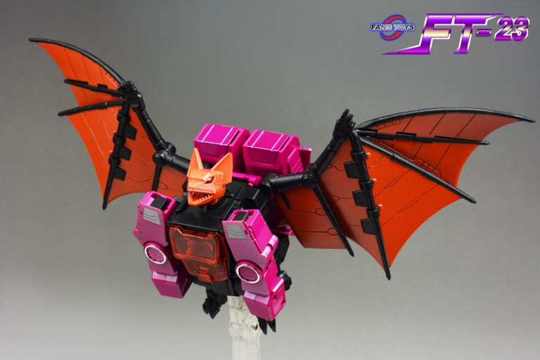

# Index <a name="Index"/>
- [Links](#Links)
- [FT Series](#FT-Series)

# Links

[Back to Index](#Index)

- Website: [Fans Toys Studio](http://fanstoys.com/)
- Weibo: [Fans Toys](https://www.weibo.com/fanstoys)
- Forums: [TFW2005 Release Schedule](https://www.tfw2005.com/boards/threads/fanstoys-release-schedule-past-present.1131336/?fbclid=IwAR3HUat2MeOrt3Hm6-iEsIDrnMCRXCcaYtcsHxZq68IH91aLcqdUKozewTI)
- Wiki: [WikiAlpha FansToys](https://en.wikialpha.org/wiki/FansToys)
- Stores: 
    - [Show.Z Store Fans Toys](https://showzstore.com/c/fanstoys_0381)
    - [FTSource Fans Toys](https://tfsource.com/fans-toys/)

# FT Series

[Back to Index](#Index)

## FT-02 Acoustic Wave

## FT-03 Quake Wave (Shockwave)
## FT-03C Quake Wave (Shockwave)
## FT-03T Quake Wave (Shockwave)

## FT-04 Scoria (Slag)
## FT-04D Scoria (Slag)
## FT-04G Scoria (Slag)
## FT-04T Scoria (Slag)
## FT-04X Scoria (Slag)

## FT-05 Soar (Swoop)
## FT-05T Soar (Swoop)
## FT-05X Soar (Swoop)
## FT-05XT Soar (Swoop)

## FT-06 Sever (Snarl)
## FT-06D Sever (Snarl)
## FT-06G Sever (Snarl)
## FT-06X Sever (Snarl)

## FT-07 Stomp (Sludge)
## FT-07X Stomp (Sludge)

## FT-08 Grinder (Grimlock)
## FT-08D Grinder (Grimlock)
## FT-08G Grinder (Grimlock)
## FT-08X Grinder (Grimlock)

## FT-09 Tesla (Perceptor)

## FT-10 Phoenix (Skyfire)
## FT-10X Phoenix (Skyfire)

## FT-11 Spotter (Reflector)

## FT-12 Grenadier (Bombshell)
## FT-12T Grenadier (Bombshell) 

## FT-13 Mercenary (Shrapnel)

## FT-14 Forager (Kickback)

## FT-15 Willy (Hound)

## FT-16 Sovereign (Galvatron)

## FT-17 Hoodlum (Hot Rod)

## FT-18 Lupus (Weirdwolf)

## FT-19 Apache (Springer)

## FT-20 Terminus Giganticus (Omega Supreme)

## [FT-20G Terminus Giganticus limited edition](https://fanstoys.com/archives/482) (Omega Supreme)

## [FT-21 Berserk](https://fanstoys.com/archives/311) (Blitzwing)

## [FT-22 Koot](https://fanstoys.com/archives/321) (Kup)

## [FT-23 Dracula](https://fanstoys.com/archives/336) (Mindwipe - Headmaster)

## [FT-24 Rouge](https://fanstoys.com/archives/347) (Arcee)

## [FT-25 Outrider](https://fanstoys.com/archives/364) (Trailbreaker)

## [FT-26 Chomp](https://fanstoys.com/archives/370) (Skullcruncher)

## [FT-27 Spindrift](https://fanstoys.com/archives/381) (Seaspray)

## [FT-28 Hydra](https://fanstoys.com/archives/388) (Sixshot)

## [FT-29 Quietus](https://fanstoys.com/archives/402) (Cyclonus)

## [FT-30A Maverick](https://fanstoys.com/archives/419)

## [FT-30B Iceman](https://fanstoys.com/archives/485)

## [FT-30C Goose](https://fanstoys.com/archives/506)

## [FT-31A Roadking](https://fanstoys.com/archives/429) (Motormaster/Stunticons/Menasor)

## [FT-31B Magnum](https://fanstoys.com/archives/496) (Deadend/Stunticons/Menasor)

## [FT-31C Spoiler](https://fanstoys.com/archives/515) (Breakdown/Sunticons/Menasor)

## [FT-39 Jabber](https://fanstoys.com/archives/440)

## FT-40 Fortress Maximus

## [FT-41 Sheridan](https://fanstoys.com/archives/526)

## [FT-42 Hunk](https://fanstoys.com/archives/450) (Brawn)

## [FT-43 Dunerider](https://fanstoys.com/archives/461)

## FT-44 Thomas (Astrotrain)

[Back to Index](#Index)

<a href="#Index" style="text-align: right">Back to Index</a>
