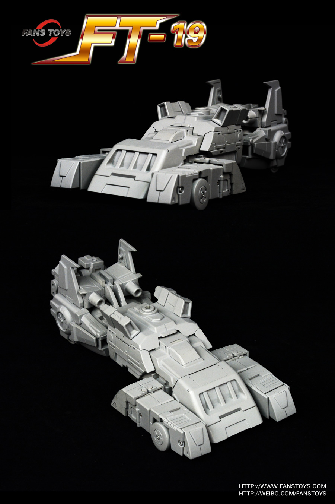
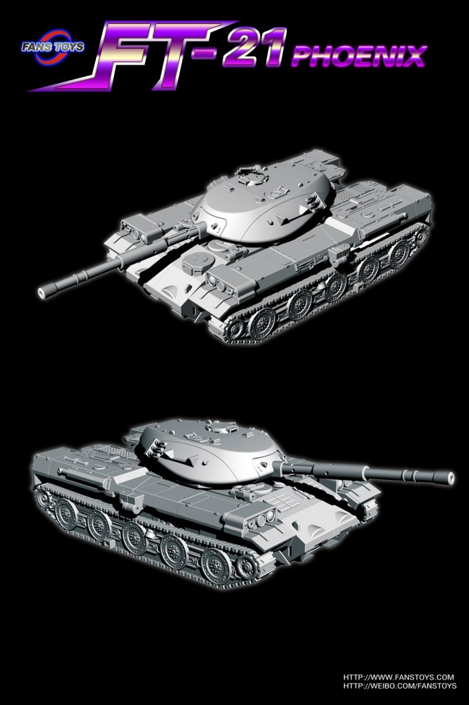
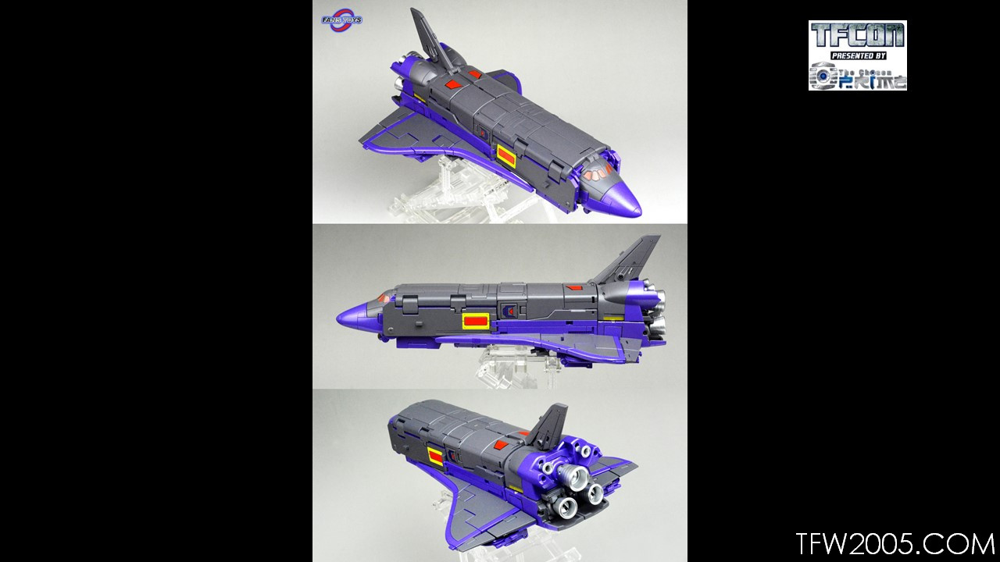

# Index <a name="Index"/>
- [Links](#Links)
- [FT Series](#FT-Series)

# Links

- Website: [Fans Toys Studio](http://fanstoys.com/)
- Weibo: [Fans Toys](https://www.weibo.com/fanstoys)
- Forums: [TFW2005 Release Schedule](https://www.tfw2005.com/boards/threads/fanstoys-release-schedule-past-present.1131336/?fbclid=IwAR3HUat2MeOrt3Hm6-iEsIDrnMCRXCcaYtcsHxZq68IH91aLcqdUKozewTI)
- Wiki: [WikiAlpha FansToys](https://en.wikialpha.org/wiki/FansToys)
- Stores: 
    - [Show.Z Store Fans Toys](https://showzstore.com/c/fanstoys_0381)
    - [FTSource Fans Toys](https://tfsource.com/fans-toys/)

<a href="#Index" style="text-align: right">Back to Index</a>

# FT Series

## FT-02 Acoustic Wave

## FT-03 Quake Wave (Shockwave)

## FT-03C Quake Wave (Shockwave)

## FT-03T Quake Wave (Shockwave)

## FT-04 Scoria (Slag)

## FT-04D Scoria (Slag)

## FT-04G Scoria (Slag)

## FT-04T Scoria (Slag)

## FT-04X Scoria (Slag)

## FT-05 Soar (Swoop)

## FT-05T Soar (Swoop)

## FT-05X Soar (Swoop)

## FT-05XT Soar (Swoop)

## FT-06 Sever (Snarl)

## FT-06D Sever (Snarl)

## FT-06G Sever (Snarl)

## FT-06X Sever (Snarl)

## FT-07 Stomp (Sludge)

## FT-07X Stomp (Sludge)

## [FT-08 Grinder](https://fanstoys.com/archives/149) (Grimlock)

## [FT-08D Grinder](https://fanstoys.com/archives/156) (Grimlock)

## [FT-08G Grinder](https://fanstoys.com/archives/156) (Grimlock)

## [FT-08X Grinder](https://fanstoys.com/archives/156) (Grimlock)

## [FT-09 Tesla](https://fanstoys.com/archives/182) (Perceptor)

## [FT-10 Phoenix](https://fanstoys.com/archives/188) (Skyfire)

## [FT-10X Phoenix](https://fanstoys.com/archives/208) (Skyfire)

## [FT-11 Spotter](https://fanstoys.com/archives/210) (Reflector)

## [FT-12 Grenadier](https://fanstoys.com/archives/221) (Bombshell)

## FT-12T Grenadier (Bombshell) 

## [FT-13 Mercenary](https://fanstoys.com/archives/232) (Shrapnel)

## [FT-14 Forager](https://fanstoys.com/archives/240) (Kickback)

## [FT-15 Willy](https://fanstoys.com/archives/248) (Hound)

## [FT-16 Sovereign](https://fanstoys.com/archives/259) (Galvatron)

## [FT-17 Hoodlum](https://fanstoys.com/archives/269) (Hot Rod)

## [FT-18 Lupus](https://fanstoys.com/archives/282) (Weirdwolf)

## [FT-19 Apache](https://fanstoys.com/archives/293) (Springer)

## [FT-20 Terminus Giganticus](https://fanstoys.com/archives/302) (Omega Supreme)

## [FT-20G Terminus Giganticus limited edition](https://fanstoys.com/archives/482) (Omega Supreme)

## [FT-21 Berserk](https://fanstoys.com/archives/311) (Blitzwing)

## [FT-22 Koot](https://fanstoys.com/archives/321) (Kup)

## [FT-23 Dracula](https://fanstoys.com/archives/336) (Mindwipe - Headmaster)

## [FT-24 Rouge](https://fanstoys.com/archives/347) (Arcee)

## [FT-25 Outrider](https://fanstoys.com/archives/364) (Trailbreaker)

## [FT-26 Chomp](https://fanstoys.com/archives/370) (Skullcruncher)

## [FT-27 Spindrift](https://fanstoys.com/archives/381) (Seaspray)

## [FT-28 Hydra](https://fanstoys.com/archives/388) (Sixshot)

## [FT-29 Quietus](https://fanstoys.com/archives/402) (Cyclonus)

## [FT-30A Maverick](https://fanstoys.com/archives/419)

## [FT-30B Iceman](https://fanstoys.com/archives/485)

## [FT-30C Goose](https://fanstoys.com/archives/506)

## [FT-31A Roadking](https://fanstoys.com/archives/429) (Motormaster/Stunticons/Menasor)

## [FT-31B Magnum](https://fanstoys.com/archives/496) (Deadend/Stunticons/Menasor)

## [FT-31C Spoiler](https://fanstoys.com/archives/515) (Breakdown/Sunticons/Menasor)

## [FT-39 Jabber](https://fanstoys.com/archives/440)

## FT-40 Fortress Maximus

## [FT-41 Sheridan](https://fanstoys.com/archives/526)

## [FT-42 Hunk](https://fanstoys.com/archives/450) (Brawn)

## [FT-43 Dunerider](https://fanstoys.com/archives/461)

## FT-44 Thomas (Astrotrain)

<a href="#Index" style="text-align: right">Back to Index</a>
